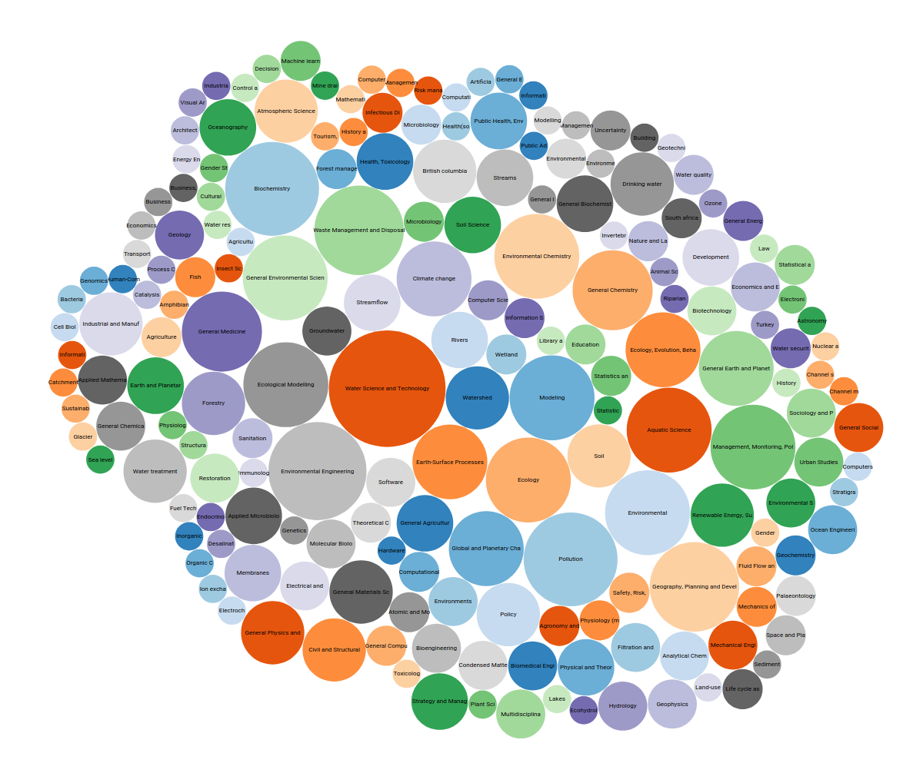
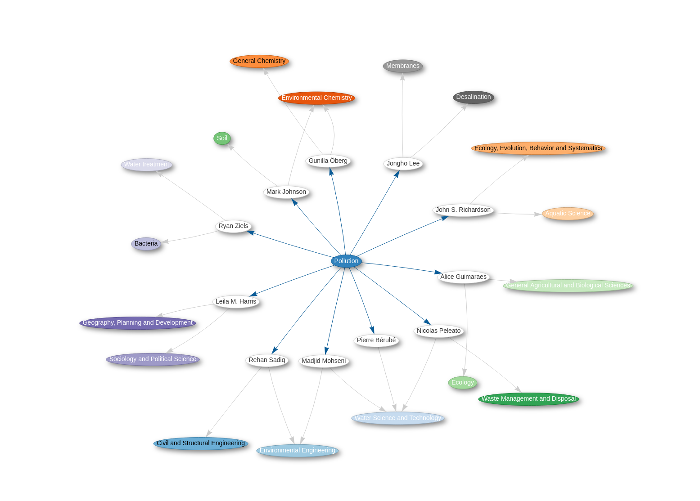
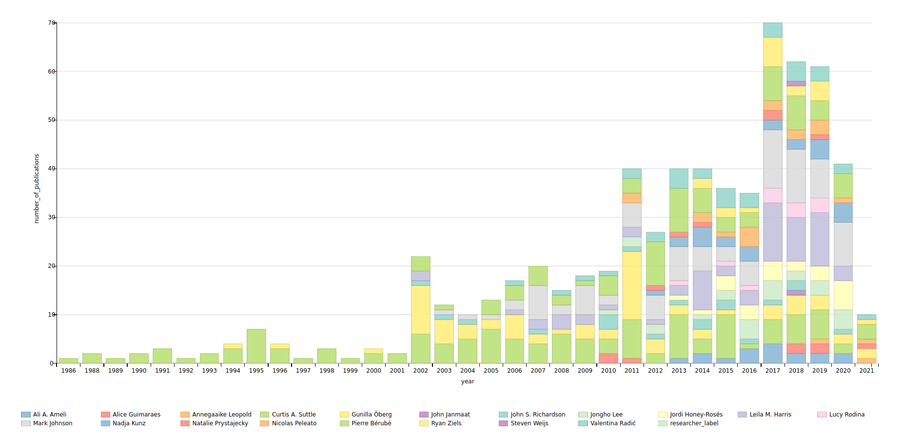

# Future Waters Visualizations

This project details technologies, scripts, and workflow for visualizing data about a research cluster using Open Source Technologies. 

Most of the data is publicly available at [Wikidata](https://www.wikidata.org/wiki/Wikidata:Main_Page) and we make use of [Crossref](https://www.crossref.org/documentation/retrieve-metadata/rest-api/), [Open Refine](https://openrefine.org/), and [Scholia](https://scholia.toolforge.org/) to gather publication data about a list of authors, upload the data to Wikidata, and visualize it, respectively.

___

* Sample visualization of topics investigated by cluster members

<div style="text-align:center"></div>


* Sample visualization of relationships between topics and cluster members

<div style="text-align:center"></div>

* Sample visualization of publications per year per author for the research cluster

<div style="text-align:center"></div>

___

## Setup

1. [Download and install docker](https://docs.docker.com/get-started/)
1. [Download and install Python 3.7 or higher](https://www.python.org/downloads/)
    * You only need python locally for small tasks such as clearing cached data
1. [Download and install OpenRefine](https://openrefine.org/download.html), preferably the stable version --- OpenRefine 3.3

___

## Instructions

1. Run the [data-gathering scripts](documentation/scripts.md) to fetch data
1. Upload and clean the data with Open Refine
    * [authors](documentation/open-refine.md)
    * [papers](documentation/open-refine-papers.md)
1. View visualizations via the `future-waters-viz` Docker container
    * [scholia](documentation/scholia.md)
___

## Docker

The bulk of the project is available in a self-contained environment, namely a Docker container. Instructions on running docker are available below and also on the [python scripts](documentation/scripts.md).


### Data Gathering

0. Input: your input should be a `cluster-members.csv` file that must be copied in the `/data-gathering/resources` folder

An example for key columns in your `csv` is presented below:

<br>

|Full Name      |Affiliation                   |Position           |Department                                            |Faculty         |Campus   |wikidata |
|---------------|------------------------------|-------------------|------------------------------------------------------|----------------|---------|---------|
|Ali Ameli      |University of British Columbia|Assistant Professor|Earth Ocean and Atmospheric Sciences                  |Sciences        |Vancouver|         |
|Alice Guimaraes|University of British Columbia|PhD Student        |Norman B Keevil Institute of Mining Engineering       |Applied Sciences|Vancouver|Q27980222|
|Gunilla Öberg  |University of British Columbia|Professor          |Institute for Resources Environment and Sustainability|Sciences        |Vancouver|         |
|John Janmaat   |University of British Columbia|Associate Professor|Economics,Philosophy and Political Science            |Arts            |Okanagan |         |

<br>

Note that the **scripts are case sensitive** and the input columns must match the ones provided in the example

___


1. Build the base docker container running:


```shell
cd data-gathering
docker build -t libraryrc/future-waters .
```

___

2. Run the container

First get the path where you downloaded the project

```shell
pwd
```

The output will be something similar to  `/home/msarthur/Workspace/future-waters-project`

Update the path in the volume argument in the command below, e.g.: `-v /home/msarthur/Workspace/future-waters-project/resources:/tmp/src/resources`


```shell
docker run --name=future-waters -v !!your path!!/resources:/tmp/src/resources libraryrc/future-waters
```


For example, for the output path that I got, the volume path should read:

```shell
docker run --name=future-waters -v /home/msarthur/Workspace/future-waters-project/data-gathering/resources:/tmp/src/resources libraryrc/future-waters
```

**IMPORTANT** The results from the scripts will be under the resources folder (in various subfolders).
___

3. Change file permissions at output folder running the following command

```shell
sudo chown -R $USER:$USER resources
```

___


4. Running the container after its creation


You need to remove previous named containers with the `future-waters` identifier. Run


```shell
docker rm future-waters && docker run --name=future-waters -v !!your path!!:/tmp/src/resources libraryrc/future-waters
```


For example:

```shell
docker rm future-waters && docker run --name=future-waters -v /home/msarthur/Workspace/future-waters-project/data-gathering/resources:/tmp/src/resources libraryrc/future-waters
```
___


5. Important

If there are updates on the python scripts, you must build a new image to reflect these changes on the container. To rebuild the entire pipeline, run:


docker rm future-waters && \
docker build -t libraryrc/future-waters . && \
docker run --name=future-waters -v <your path>:/tmp/src/resources libraryrc/future-waters


For example:

```shell
docker rm future-waters && \
docker build -t libraryrc/future-waters . && \
docker run --name=future-waters -v /home/msarthur/Workspace/future-waters-project/data-gathering/resources:/tmp/src/resources libraryrc/future-waters
```

___


### Data Visualization

**IMPORTANT** all other docker commands are executed inside a specific folder. This command should **run in the project root folder**

1. Build the container

```shell
docker build -t libraryrc/future-waters-viz .
```

___


2. Run the container

```shell
docker run --name=future-waters-viz -p 8100:8100  libraryrc/future-waters-viz
```

___


3. Subsequent executions:


```
docker rm future-waters-viz && \
docker run --name=future-waters-viz -p 8100:8100  libraryrc/future-waters-viz
```

___


4. Helpful for development environment:

Remove last container, build and run new version in a single command


```shell
docker rm future-waters-viz && \
docker build -t libraryrc/future-waters-viz . && \
docker run --name=future-waters-viz -p 8100:8100  libraryrc/future-waters-viz
```

___

5. Check visualizations on your local browser at http://localhost:8100

    * Find details on how we create each visualization [here](documentation/scholia.md)


### Troubleshooting

* Check some [known issues](https://github.com/ubc-library-rc/future-water-project/issues) in the project GitHub Web page

* In case you encounter problems trying to replicate this project, please [submit a new issue](https://github.com/ubc-library-rc/future-water-project/issues/new/choose). When submitting an issue, maintainers would appreciate if you could disclose:

    * What is your Operating system?

    * What version of Python do you have installed?

    * Is there a stack trace or error log in the application console?

___


<br>
<br>

<div style="text-align:center"></div>
