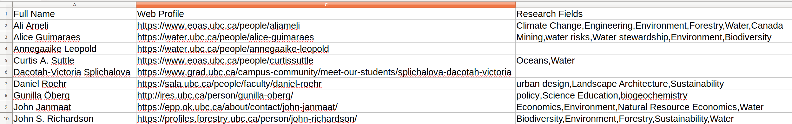

# future-water-project


## Setup

1. [Download and install docker](https://docs.docker.com/get-started/)
1. [Download and install Python 3.7 or higher](https://www.python.org/downloads/)
1. [Download and install OpenRefine](https://openrefine.org/download.html), preferrably the stable version --- OpenRefine 3.3

___

## Instructions


### Fetching data on Wikidata, Crossref & Google Scholar

All data produced and consumed by the scripts or scholia lives under `resources`

Start by uploading the `cluster-members.csv` file to resources. The file must contain the full name of the researchers in the Future Waters Cluster. For example:




1. **Build the two docker images required for this project:**

Base image:

```shell
cd docker/base
docker build -t libraryrc/future-waters .
```


Script images:

```shell
docker build -t libraryrc/future-waters .
```
___

2. **Find and update docker volume parameter**

You need to get your current working directory so that you can run the docker script pointing it to the shared `resources` folder

First get the path where you downloaded the project

```shell
pwd
```

The output will be something similar to  

```shell
/home/msarthur/Workspace/future-water-project
```

Update the path in the volume argument in the command on step 3, accordingly.

For example, for the previous output, the command `-v <your path>:/tmp/src/resources` should be updated to: 

```shell
-v /home/msarthur/Workspace/future-water-project/resources:/tmp/src/resources
```

This is **very important** because all the output of the docker scripts will be written to the `resources` folder and you need a [shared volume](https://docs.docker.com/storage/volumes/) to pass data from your local machine to the docker container (and vice-versa).

___


3. **Run the docker scripts**

Note that the scripts make heavy use of `caching` so that a cluster member is not processed more than once. If you ever need to reprocess someone, see [Clearing cache](##Clearing-cache).


```shell
docker run --name=future-waters -v <your path>/resources:/tmp/src/resources libraryrc/future-waters
```
___

### Output

The output will resemble the folder structure below:


```
resources
├── crossref
│   ├── ali_ameli.json
│   ├── alice_guimaraes.json
│   ├── ...
│   └── valentina_radić.json
├── imports
│   ├── authors
│   │   ├── open_refine_ali_ameli.csv
│   │   ├── open_refine_alice_guimaraes.csv
│   │   ├── ...
│   │   └── open_refine_valentina_radić.csv
│   ├── future-water-cluster.csv
│   ├── open_refine_authors.csv
│   ├── open_refine_paper_list.csv
│   └── open_refine_paper_list.json
├── papers
│   ├── paper_data_ali_ameli.json
│   ├── paper_data_alice_guimaraes.json
│   ├── ...
│   └── paper_data_valentina_radić.json
├── quick-statements
├── scholarly
│   ├── ali_ameli.json
│   ├── alice_guimaraes.json
│   ├── ...
│   └── valentina_radić.json
└── wikidata
    ├── ali_ameli.json
    ├── alice_guimaraes.json
    ├── ...
    └── valentina_radić.json

```

It may look complex at first glance, but you do not need to worry too much about it. 
The most important data should be under `imports` and `papers`.

* `imports` --- produces `.csv` files with the authors that need to be uploaded to Wikidata as well as their papers. The papers are available either in `open_refine_paper_list.csv`, which contains the whole list of papers or in `imports/author` which contains the list of papers per cluster member

* `papers` --- produces `.json` files with additional data that will be used to produce the cluster visualizations

___


Other files explained by folder:


* `scholarly` --- produces `.json` files with data obtained from the Google scholar API, namely [scholarly](https://pypi.org/project/scholarly/). As mentioned in the documentation, *Google scholar does not like bots* and to avoid being blocked, we make use of [Tor](https://www.torproject.org/about/history/), as [recommended by the documentation](https://scholarly.readthedocs.io/en/latest/quickstart.html#using-proxies);

    * Usage of Tor should be seamless as all of its logic is encapsulated under the Docker container;

    * Is Tor usage legal? We are using Tor because it masks our IP via usage of [onion routing](https://en.wikipedia.org/wiki/Onion_routing) and thus, we can't be blocked by Google scholar. The same could have been achieved using a series of VPNs to get IPs all over the world. So yes, for the purposes of finding data online, we are not doing anything illegal.

* `crossref` --- produces `.json` files with data obtained from the [Crossref REST API](https://www.crossref.org/education/retrieve-metadata/rest-api/);

    * One thing critical about Crossref is that some of its data does not accurately match our input data. This is a known problem discussed in the [Open Access project](https://github.com/OpenAPC/openapc-de);
    
    * We adapt the Open Access project python [disambiguation script](https://github.com/OpenAPC/openapc-de/blob/master/python/import_dois.py) to avoid this problem;

    * This uses [Levenshtein distance](https://en.wikipedia.org/wiki/Levenshtein_distance) for authors and publications' name comparison, so there will still be false positves on the data obtained by Crossref;

* `wikidata` --- produces the `.json` data with all the papers of a cluster member. To this end, it obtains Wikidata through the [Wikidata query service](https://www.wikidata.org/wiki/Wikidata:SPARQL_query_service) and evaluates what is not already there bu checking the data available under `scholarly` and `crossref`;


**Important**: Note that all the files are organized by author's names. 

___


## Clearing cache

___


## Docker container instructions


1. Build the base docker container running:


```shell
cd docker/base
docker build -t libraryrc/future-waters .
```


2. Build the base docker container running:


```shell
docker build -t libraryrc/future-waters .
```

3. Run the container

First get the path where you downloaded the project

```shell
pwd
```

The output will be something similar to  `/home/msarthur/Workspace/future-water-project`

Update the path in the volume argument in the command below. `-v /home/msarthur/Workspace/future-water-project/resources:/tmp/src/resources`


```shell
docker run --name=future-waters -v <your path>/resources:/tmp/src/resources libraryrc/future-waters
```

For example, for the output path that I got, the volume path should read

4. Change file permissions at output folder

```shell
sudo chown -R $USER:$USER resources
```


5. Important

If there are updates on the python scripts, you must build a new image to reflect these changes on the container. Run:


```shell
docker rm libraryrc/future-waters
```

Repeat steps `1.` to `3.` afterwards


6. Helpful tips for development environment

Remove last container, build and run new version in a single command

```shell
docker rm future-waters && \
docker build -t libraryrc/future-waters . && \
docker run --name=future-waters -v /home/msarthur/Workspace/future-water-project/resources:/tmp/src/resources libraryrc/future-waters
```


___

## gibberish


Use reference in member of to state from when to when

If main topic does not work, think about how to use non-wiki data
-- this is where I'm currently at

~~Sponsor is not the best field because there are multiple grants and papers before the cluster was created~~

Disconsider relative weight ofr the time being

Do not infer a ubject if there is not one
-- done


Interesting visualization https://scholia.toolforge.org/authors/Q80,Q6135847,Q30085536

https://scholia.toolforge.org/project/Q27949537


We want P859 sponsor, so we can leverage: https://scholia.toolforge.org/project/Q27949537


https://www.wikidata.org/wiki/Q57202727  --- will be edited, successfully edited


## Most realistic approach is to:

1. do for two authors
2. see all viz

3. go back and do for reminder of the cluster.
    * It alleviates work on my end as someone else can do the open refine checks while I work on viz


# Use case

https://scholia.toolforge.org/author/Q57582079

does not get https://www.wikidata.org/wiki/Q53465413 even though Ameli A Ameli is second author

## Wikidata Research Centre

https://www.wikidata.org/wiki/Q106489997

https://www.wikidata.org/wiki/Wikidata:WikiProject_Stanford_Libraries/Data_models#Research_center_affiliated_with_a_university


## Wikidata Researchers

Example of [Ghandi](https://www.wikidata.org/wiki/Q1001) shows that `member of` can be a list

## Wikidata Publications

### Examples already on Wikidata

* [Does Wetland Location Matter When Managing Wetlands for Watershed‐Scale Flood and Drought Resilience?](https://www.wikidata.org/wiki/Q104878985)
* [A test of the effects of timing of a pulsed resource subsidy on stream ecosystems.](https://www.wikidata.org/wiki/Q39924137)

## Open Refine

https://www.youtube.com/watch?v=wfS1qTKFQoI
