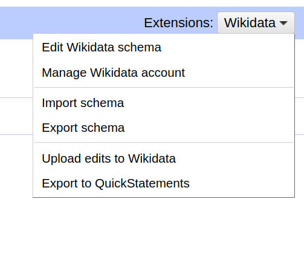
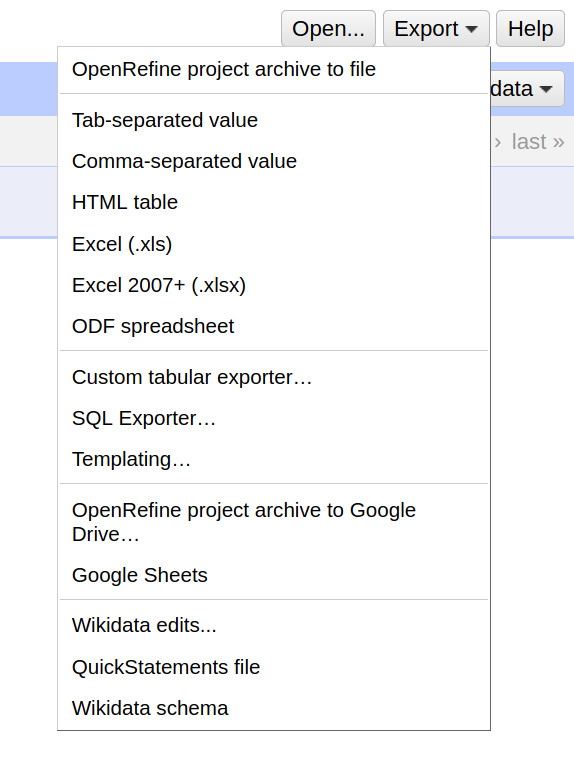
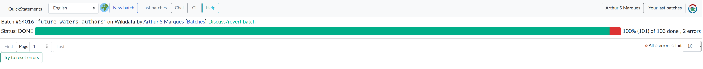

# Open Refine

OpenRefine (previously Google Refine) is a powerful tool for working with messy data: cleaning it; transforming it from one format into another; and extending it with web services and external data.

This [video tutorial](https://www.youtube.com/watch?v=wfS1qTKFQoI) provides some guidance on basic features about Open Refine

1. Start Open refine (varies depending on OS)

2. Open http://localhost:3333

## Importing Papers 

1. In the open refine landing page, click on the `browse` button

2. Navigate to the project folder, and locate the author you want to import, e.g. `resources/imports/authors/alice_guimaraes.csv`

3. Select the file and click `open`

4. Click `next`

5. Inspect the author preview

6. If everything is correct, name your project, e.g. `future waters cluster alice publications` and click `Create project` (both located on top-right corner)

7. Reconcile each column that has a `P<number>`. 

    * Details on reconcile are similar to the ones in the [authors](open-refine.md) documentation

**IMPORTANT -- Reconcile properties**

Copy and paste the property identifierr `Q<number>` in the 

* P31 -- scholarly article `Q13442814`
* P50 -- Human `Q5`
* P356 -- digital object identifier `Q25670`
* P1476 -- scholarly article `Q13442814`
* P1433 -- scientific journal `Q5633421`
* P577 -- calendar day of a given year `Q47150325`

**Important** 

Some journals are not matched right away, only create a journal if you click `search for a match` and you can't find it.

* Example of search for match menu link

        

* Example searching for a match for the `People and Nature` journal

        

# Export to Wikidata

Let's export the data to Quickstatements so it can be uploaded to Wikidata

## Create quickstatements export

**IMPORTANT** there is an option to import directly to Wikidata, but due to the amount of papers/authors that we will import, this option will not work

1. On the extensions menu on the top-right corner, select `Import schema`

2. Navigate to the project folder under `resources/schemas` select `papers.json`

3. Click `Open`

4. If the schema was imported as expected, you should see:

5. If this is the first time importing papers for an author, you should be able to see a preview of the data under the `Preview` tab

6. Click export on the top-right corner, select `Quickstatements file`

7. Save the file under `resources/quickstatements` preferably with a name that you will recognize

## Batch Import

1. Navigate to the OLD quickstatements interface at https://quickstatements.toolforge.org/index_old.html

2. Log in (may need to sign up)

3. You should see a welcome page similar to: 

If not, try the `Import commands` menu and jump to step `5`

4. Click new batch

5. Copy and paste the content of your exported file here

6. Click `Import V1 commands`, or jump to step `8`

7. The interface will show you a preview of the commands after parsing

8. Click `Run in background` 

9. Name your batch so you can check it later, e.g., `future-waters-papers-<author>`

10. Sometimes, `errors` will happen. It's worth using the `Try to reset errors` option once or twice:

11. All good. Go have some coffee. ☕☕