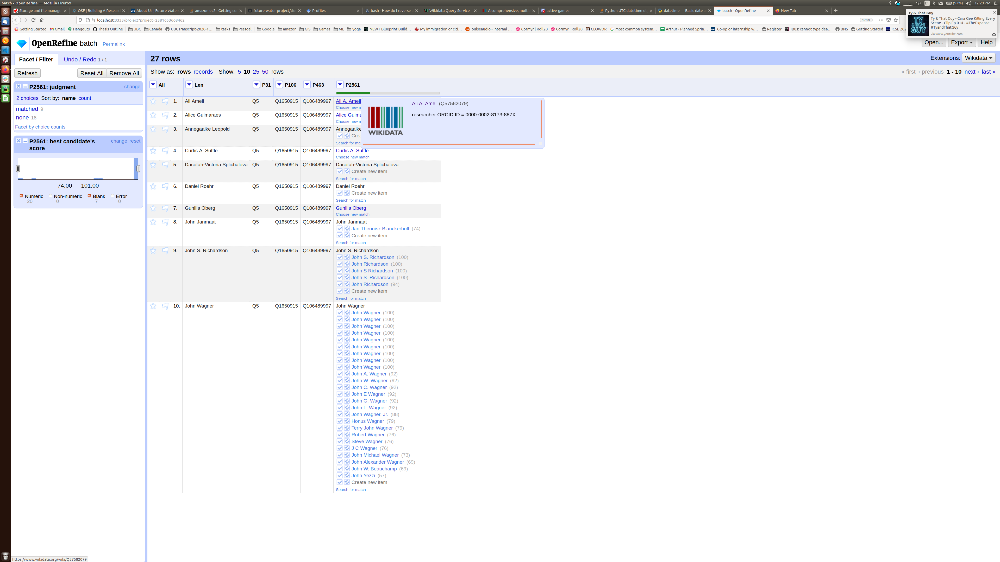
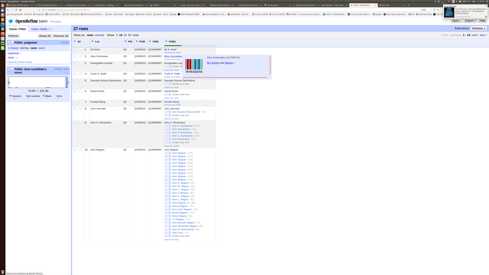

# Open Refine

OpenRefine (previously Google Refine) is a powerful tool for working with messy data: cleaning it; transforming it from one format into another; and extending it with web services and external data.

This [video tutorial](https://www.youtube.com/watch?v=wfS1qTKFQoI) provides some guidance on basic features about Open Refine

1. Start Open refine (varies depending on OS)

2. Open http://localhost:3333

## Importing Authors 

1. In the open refine landing page, click on the `browse` button

2. Navigate to the project folder, and locate `resources/imports/open_refine_authors.csv`

3. Select the file and click `open`

4. Click `next`

5. Inspect the author preview

6. If everything is correct, name your project, e.g. `future waters cluster members` and click `Create project` (both located on top-right corner)

7. Reconcile each column that has a `P<number>`. I'll show an example for the Authors' name (`P2561`), but note that **every column** is reconciled in some unique way. Use the guideline below to see the property used for each column:

**IMPORTANT -- Reconcile properties**

* P31 -- organisms known by a particular name `Q55983715`
* P106 -- occupation `Q12737077`
* P463 -- organization `Q43229`
* P2561 -- Human `Q5`

### Reconcile example

1. Click the arrow near a column

2. Select the last option `Reconcile > start reconciling...`

3. On the reconcile welcome page, click `Wikidata`

4. Wait for processing, you will see the reconcile against Wikidata page:

5. Locate the option: reconcile against type, and use the property guidelines. Sometimes, it automatically detects the right type when using the unique Wikidata identifier `Q<number>`.
If the identifier fails, it is safer to type the text (e.g., `organization`) and select only the property that exactly matches the identifier (`Q<number>`):

    * in this example, we are typing `Human` 
    * a dropdown menu will show all the information on wikidata related to what we just wrote.
    * Select `Human` (`Q5`)

    

    * **Important** sometimes there is more than one property with the same name, it's safer to type the entire name first and only use partial matches when a search for the full name did not work. Check  `organization` the correct match is the one with ID `Q43229`

    

6. Click `Start reconciling`

___

### Disambiguate example

Once reconciled, a column will show a green bar and several options

We need to make sure that the data that we are importing is correct:

1. Hove over a link, e.g., `Ali A. Ameli`

    * It found the cluster member because their data is already on Wikidata, so no action is required here

    

2. Hove over the second link , e.g., `Alice`

    * It found someone with the same name, but a film director. This is **NOT** the right data, so we need to click `choose new match`   

    

    * Click the doubled `v` check mark: `Create new item`

    

3. Repeat this process for all rows. Note that sometimes, there will be more than on researcher with the same name, e.g.: `John Lee`

    * [John Lee](https://www.wikidata.org/wiki/Q90016862) -- Q90016862
    * [John Lee](https://www.wikidata.org/wiki/Q89490605) -- Q89490605
    * [John Lee](https://www.wikidata.org/wiki/Q59670257) -- Q59670257

    * You will have to open each link, inspect their info and decide by yourself if any of them match or if you need to create a new entry.

    * In this example, the entry with `Q90016862` is the researcher from UBC, so we select it by clicking the doubled `v` check mark: `Create new item`

4. When you are not sure, click the `star` in the first column of a row

### Final steps

After you reconcile every column, your OpenRefine should look like:

    

We need to remove results that we are not sure about. 

1. Click the arrow on all. Select `Facet > facet by star`

    

2. Click the `true` link on the left side

    

3. Review that only two entries match the filter

    

4. Click the arrow on all. Select `Edit rows > Remove matching rows`

    

5. Click `Reset all` on the left after you are done. 

# Export to Wikidata

Let's export the data to Quickstatements so it can be uploaded to Wikidata

## Create quickstatements export

**IMPORTANT** there is an option to import directly to Wikidata, but due to the amount of papers/authors that we will import, this option will not work

1. On the extensions menu on the top-right corner, select `Import schema`

2. Navigate to the project folder under `resources/schemas` select `author.json`

3. Click `Open`

4. If the schema was imported as expected, you should see:

5. Click export on the top-right corner, select `Quickstatements file`

6. Save the file under `resources/quickstatements` preferably with a name that you will recognize

## Batch Import

1. Navigate to the OLD quickstatements interface at https://quickstatements.toolforge.org/index_old.html

2. Log in (may need to sign up)

3. You should see a welcome page similar to:

4. Click new batch

5. Copy and paste the content of your exported file here, e.g.:

6. Click `Import V1 commands`

7. The interface will show you a preview of the commands after parsing:

8. Click `Run in background` 

9. Name your batch so you can check it later, e.g., `future-waters-authors`

10. Sometimes, `errors` will happen. It's worth using the `Try to reset errors` option once or twice:

11. All good. Go have some coffee. ☕☕