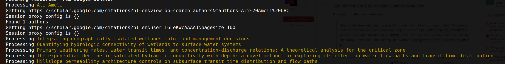

# Python scripts


## Fetching data on Wikidata, Crossref & Google Scholar

All data produced and consumed by the scripts or scholia lives under `resources`


0. **Input file**

Start by uploading the `cluster-members.csv` file to resources. The file must contain the full name of the researchers in the Future Waters Cluster. For example:


___

1. **Build the two docker images required for this project:**

Base image:

```shell
cd docker/base
docker build -t libraryrc/future-waters .
```


Script images:

```shell
docker build -t libraryrc/future-waters .
```
___

2. **Find and update docker volume parameter**

You need to get your current working directory so that you can run the docker script pointing it to the shared `resources` folder

First get the path where you downloaded the project

```shell
pwd
```

The output will be something similar to  

```shell
/home/msarthur/Workspace/future-water-project
```

Update the path in the volume argument in the command on step 3, accordingly.

For example, for the previous output, the command `-v <your path>:/tmp/src/resources` should be updated to: 

```shell
-v /home/msarthur/Workspace/future-water-project/resources:/tmp/src/resources
```

This is **very important** because all the output of the docker scripts will be written to the `resources` folder and you need a [shared volume](https://docs.docker.com/storage/volumes/) to pass data from your local machine to the docker container (and vice-versa).

___


3. **Run the docker scripts**

Note that the scripts make heavy use of `caching` so that a cluster member is not processed more than once. If you ever need to reprocess someone, see [Clearing cache](##Clearing-cache).


```shell
docker run --name=future-waters -v <your path>/resources:/tmp/src/resources libraryrc/future-waters
```

If the container runs as expected, you will see an output similar to:


___

### Output

The output will resemble the folder structure below (note that all the files are organized by author's names):


```
resources
├── crossref
│   ├── ali_ameli.json
│   ├── alice_guimaraes.json
│   ├── ...
│   └── valentina_radić.json
├── imports
│   ├── authors
│   │   ├── open_refine_ali_ameli.csv
│   │   ├── open_refine_alice_guimaraes.csv
│   │   ├── ...
│   │   └── open_refine_valentina_radić.csv
│   ├── future-water-cluster.csv
│   ├── open_refine_authors.csv
│   ├── open_refine_paper_list.csv
│   └── open_refine_paper_list.json
├── papers
│   ├── paper_data_ali_ameli.json
│   ├── paper_data_alice_guimaraes.json
│   ├── ...
│   └── paper_data_valentina_radić.json
├── quick-statements
├── scholarly
│   ├── ali_ameli.json
│   ├── alice_guimaraes.json
│   ├── ...
│   └── valentina_radić.json
└── wikidata
    ├── ali_ameli.json
    ├── alice_guimaraes.json
    ├── ...
    └── valentina_radić.json

```

It may look complex at first glance, but you do not need to worry too much about it. 
The most important data should be under `imports` and `papers`.

* `imports` --- produces `.csv` files with the authors that need to be uploaded to [Openrefine](open-refine.md) as well as their papers. The papers are available either in `open_refine_paper_list.csv`, which contains the whole list of papers or in `imports/author` which contains the list of papers per cluster member

* `papers` --- produces `.json` files with additional data that will be used to produce the cluster visualizations

___


Other files explained by folder (more technical):


* `scholarly` --- produces `.json` files with data obtained from the Google scholar API, namely [scholarly](https://pypi.org/project/scholarly/). As mentioned in the documentation, *Google scholar does not like bots* and to avoid being blocked, we make use of [Tor](https://www.torproject.org/about/history/), as [recommended by the documentation](https://scholarly.readthedocs.io/en/latest/quickstart.html#using-proxies);

    * Usage of Tor should be seamless as all of its logic is encapsulated under the Docker container;

    * We are using Tor because it masks our IP via usage of [onion routing](https://en.wikipedia.org/wiki/Onion_routing) so we can't be blocked by Google scholar. The same could have been achieved using a series of VPNs to get IPs all over the world. So for the purposes of finding data online, we are not doing anything illegal.

* `crossref` --- produces `.json` files with data obtained from the [Crossref REST API](https://www.crossref.org/education/retrieve-metadata/rest-api/);

    * One thing critical about Crossref is that some of its data does not accurately match our input data. This is a known problem discussed in the [Open Access project](https://github.com/OpenAPC/openapc-de);
    
    * We adapt the Open Access project python [disambiguation script](https://github.com/OpenAPC/openapc-de/blob/master/python/import_dois.py) to avoid this problem. This uses [Levenshtein distance](https://en.wikipedia.org/wiki/Levenshtein_distance) for authors and publications' name comparison, so there will still be false positives on the data obtained by Crossref;

* `wikidata` --- produces the `.json` data with all the papers of a cluster member. To this end, it obtains Wikidata through the [Wikidata query service](https://www.wikidata.org/wiki/Wikidata:SPARQL_query_service) and evaluates what is not already there bu checking the data available under `scholarly` and `crossref`;


___


## Clearing cache


On **Linux** or **MacOs** via terminal:

1. List all files based on author

```shell
find resources -type f -name "*<author>*"
```

For example, if we want to delete the cache for Alice Guimarães, we could run: `find resources -type f -name "*alice*"`, which would return:

```shell
resources/wikidata/alice_guimaraes.json
resources/crossref/alice_guimaraes.json
resources/papers/paper_data_alice_guimaraes.json
resources/scholarly/alice_guimaraes.json
resources/imports/authors/open_refine_alice_guimaraes.csv
```

You can provide any partial string that is suitable to finding that author. For this example `"*guimaraes*"` would yield the same output.


1. Once you confirm that there are files for the given author, we can run the command again with the `-delete` option. 


```shell
find resources -type f -name "*<author>*" -delete
```

2. Via Python:


```shell
python clean_cache.py <author>
```